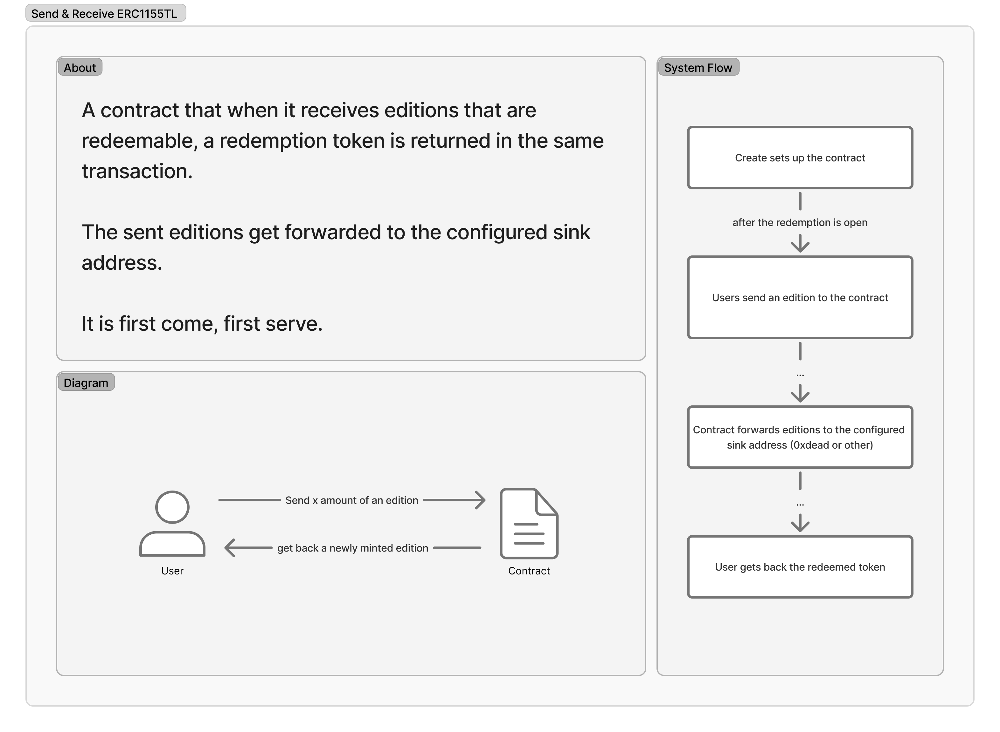
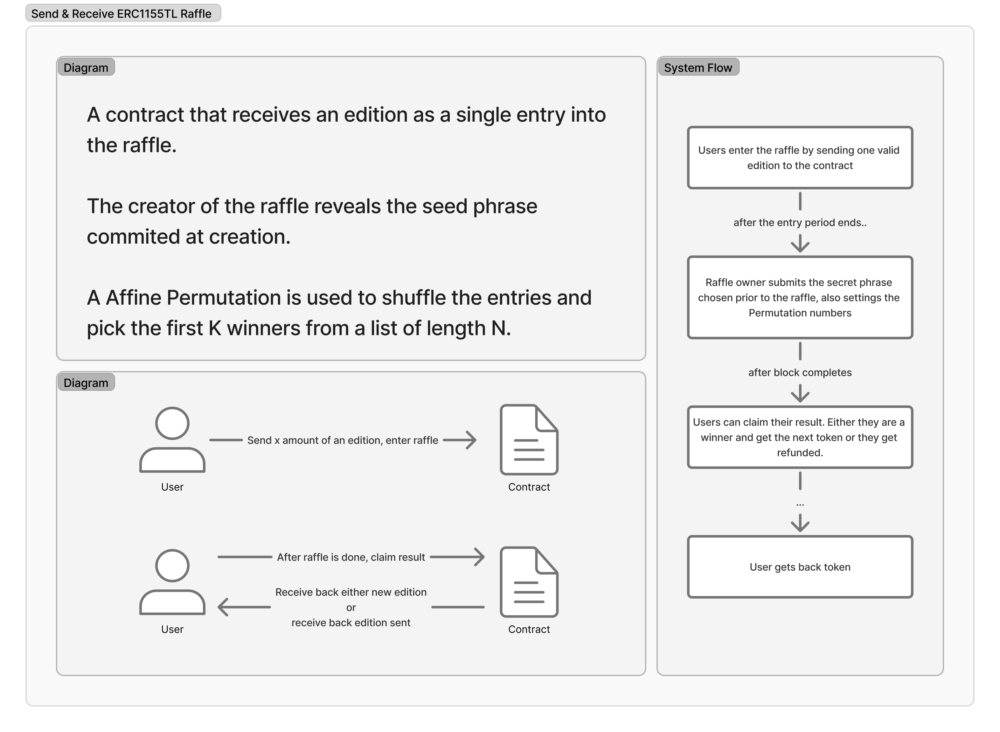
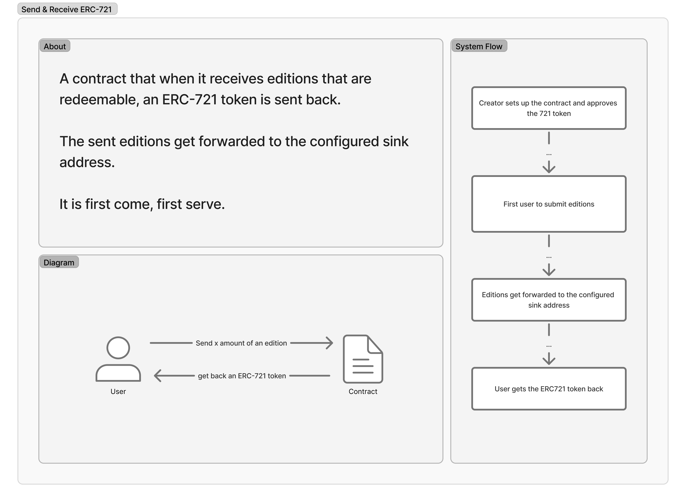
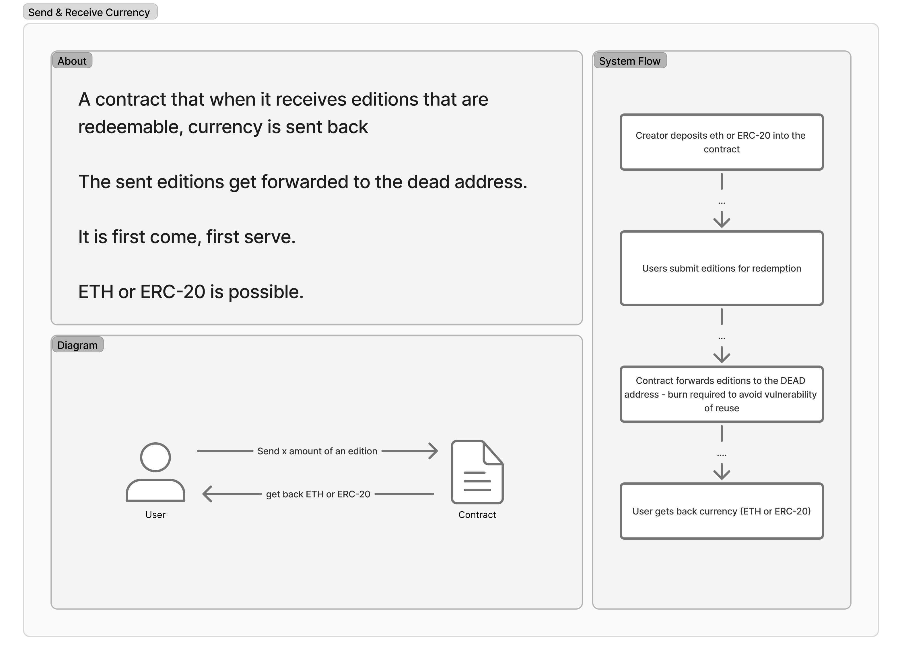
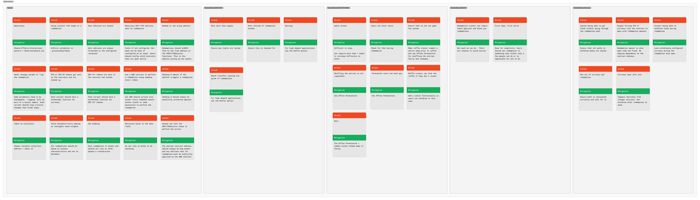

# Send and Receive
Smart contracts where you send ERC-1155 tokens and in return receive something else.

## System Explanation
The system is meant to be quite simple. It takes in ERC-1155 tokens, confirms the token + quantity of that token is available to be redeemed for something else.







### Attack Vectors


### Trust Assumptions
The contracts are built to minimize trust, however, there is some level of trust associated with each contract. The trust is meant to be minimized to lower risk and what the owner cannot change the goalposts once the rules of engagement are set.

Some notes...

`SendAndReceiveERC1155TL`: The owner must ensure that the contract stays approved to mint new ERC155TL tokens and that they do not call the emergency close function.

`SendAndReceiveERC721`: The owner must ensure they keep ownership and approval of the ERC-721 token and that they do not call the emergency close function.

`SendAndReceiveERC1155TLRaffle`: The users trust that the owner will not abandon the raffle if they don't like the results. If the owner does not reveal within 48 hours of entry end, the users can cancel the raffle at least and tokens are not locked.

`SendAndReceiveCurrency`: The users must trust that the owner will open the redemption if they are contributing currency to the contract.

## Test Coverage
```
╭---------------------------------------+-------------------+-------------------+-----------------+-----------------╮
| File                                  | % Lines           | % Statements      | % Branches      | % Funcs         |
+===================================================================================================================+
| src/SendAndReceiveCurrency.sol        | 100.00% (60/60)   | 100.00% (75/75)   | 100.00% (19/19) | 100.00% (9/9)   |
|---------------------------------------+-------------------+-------------------+-----------------+-----------------|
| src/SendAndReceiveERC1155TL.sol       | 100.00% (69/69)   | 100.00% (79/79)   | 100.00% (17/17) | 100.00% (10/10) |
|---------------------------------------+-------------------+-------------------+-----------------+-----------------|
| src/SendAndReceiveERC1155TLRaffle.sol | 100.00% (117/117) | 100.00% (141/141) | 100.00% (28/28) | 100.00% (13/13) |
|---------------------------------------+-------------------+-------------------+-----------------+-----------------|
| src/SendAndReceiveERC721.sol          | 100.00% (64/64)   | 100.00% (70/70)   | 100.00% (16/16) | 100.00% (10/10) |
|---------------------------------------+-------------------+-------------------+-----------------+-----------------|
| src/lib/AffinePermutation.sol         | 100.00% (19/19)   | 100.00% (29/29)   | 100.00% (4/4)   | 100.00% (4/4)   |
|---------------------------------------+-------------------+-------------------+-----------------+-----------------|
| src/lib/SendAndReceiveBase.sol        | 100.00% (31/31)   | 100.00% (35/35)   | 100.00% (8/8)   | 100.00% (6/6)   |
|---------------------------------------+-------------------+-------------------+-----------------+-----------------|
| Total                                 | 100.00% (360/360) | 100.00% (429/429) | 100.00% (92/92) | 100.00% (52/52) |
╰---------------------------------------+-------------------+-------------------+-----------------+-----------------╯
```

## Getting Started
1. Install [Foundry](https://book.getfoundry.sh/getting-started/installation)
2. Install [uv](https://docs.astral.sh/uv/getting-started/installation/)
3. Ensure you have python 3.13.1 installed on your machine, either using pyenv, uv, or something else.
4. Run `forge soldeer install`
5. Run `uv sync`
6. You are now ready to go!

## Running Tests
- Run `forge test` for the regular test suite
- Run `forge coverage` for coverage tests
- Run `forge test --gas-report` for a gas report

## Deploying
1. Run `source .env`
2. Run `forge script script/Deploy.s.sol:Deploy --rpc-url mainnet --sender $SENDER --ledger --broadcast`
3. Manually verify contract on etherscan through vyper json

## Adding to TLUniversalDeployer
Run `cast send --rpc-url <RPC> --ledger 0x7c24805454F7972d36BEE9D139BD93423AA29f3f "addDeployableContract(string,(string,address))" <CONTRACT NAME> "('<VERSION>',<ADDRESS>)"`

## Disclaimer
This codebase is provided on an "as is" and "as available" basis.

We do not give any warranties and will not be liable for any loss incurred through any use of this codebase.

## License
Copright (c) 2025 - Transient Labs, Inc.

Licensed under the GNU Affero General Public License v3.0 only (AGPL-3.0-only). See the `LICENSE` file for more details.